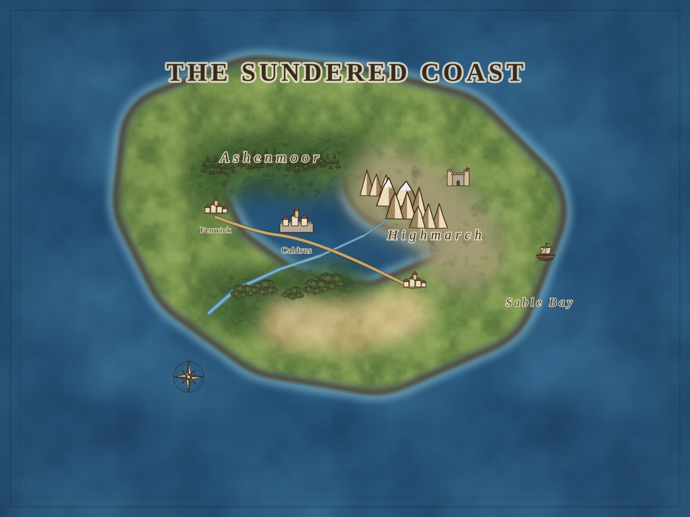
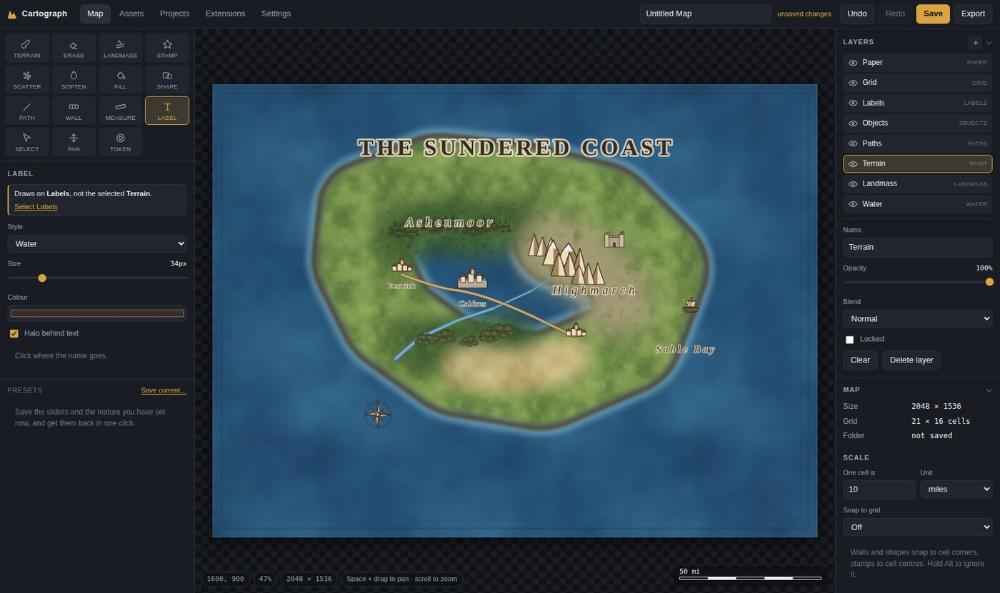

# Cartograph

A map maker for tabletop games that runs on your own machine. It opens in a
browser, but it is not a website: it is a program in a folder, with your maps,
your art and your exports sitting next to it as ordinary files you can open,
copy, back up and edit.

No account, no upload, no network. After the first launch it works with the
network cable out.





## Running it

**Windows** — double-click `run.bat`.
**macOS / Linux** — `./run.sh`.

Either way it starts a small local server, opens your browser at it, and prints
what it is doing in the console window. Close the window to stop it.

It needs **Python 3.8 or newer** and nothing else. No `pip install`, no virtual
environment, no download step — the whole program is the standard library plus
the browser you already have. If Windows says Python is not installed, get it
from [python.org](https://www.python.org/downloads/) and tick *Add Python to
PATH* during setup.

The first launch spends about ten seconds generating the starter art pack, then
never does it again.

```
python app.py                    start it
python app.py --port 7860        pin the port
python app.py --no-browser       do not open a browser
python app.py --regen-pack --seed harbour    re-roll the generated art
```

## What is in the folder

```
run.bat / run.sh      launchers
app.py                entry point — first-run setup, then serve
config.json           written on first launch: port, whether to open a browser
server/               the local HTTP server and file API (standard library only)
  http.py               transport, static files, the two security guards
  api.py                the JSON endpoints
  projects.py           reading and writing maps
  packs.py              indexing asset folders
  png.py                a PNG writer in eighty lines of zlib
  safe.py               every client-supplied path goes through here
tools/                the art generators
  terrain.py            seamless terrain tiles
  stamps.py             map symbols, as SVG
  noise.py              seamless value noise
  genpack.py            bakes the starter pack
web/                  the editor itself — plain ES modules, no build step
  js/hex.js             hex geometry: the one definition of where hexes are
  js/light.js           shadow casting for the lighting layer
assets/packs/         asset packs; drop folders in here
  starter/              generated on first launch
  user/                 anything you import
projects/             your maps, one folder each
exports/              PNGs you export
extensions/           extensions; one folder each, loaded at startup
  battle-tokens/        worked example: a tool and a layer kind
  hex-coordinates/      worked example: a generated layer and a side panel
  map-aging/            worked example: commands that draw on an existing layer
test/verify.mjs       82 end-to-end checks against the running program
test/lighting.mjs     29 more, for darkness, shadows and the VTT lights
test/hex.mjs          27 more, for hex snapping and hex-native measurement
docs/DAILY-LOG.md     what changed, day by day
EXTENSIONS.md         how to write your own extension
ASSETS.md             how to add your own art
```

## How a map is stored

A project is a folder, not an opaque file:

```
projects/The Sundered Coast/
  project.json      the whole map as readable JSON
  thumb.png         the picture shown on the Projects tab
  layers/           PNGs, only for layers holding imported pixels
```

`project.json` holds every brush stroke, stamp, path and label as **data** —
positions, sizes, textures, colours. The map is re-rendered from that when you
open it, which is why a saved map is a few kilobytes rather than a few
megabytes, and why you can diff two versions of it in git and see what changed.
Copy the folder to back a map up. Delete it to remove it.

## Working in it

The Map tab is the editor. Tools down the left with their options underneath and
the relevant art below that; the map in the middle; layers and map properties on
the right.

**Landmass** is the tool to start with. Paint where the land is and the
coastline draws itself — an ink line round the edge and a banded shallow-water
shelf outside it, both derived from the shape you painted and both updating as
you paint. Turn on *Carve sea instead* to cut bays and inlets back out of it.

**Terrain** paints textures onto a normal paint layer: forest, sand, highland,
marsh, whatever is in your packs. **Stamp** places symbols — click for one, drag
to scatter a row of them, with size, tilt and spacing variation so a forest does
not look stencilled. It mixes the three drawn variants of each symbol by
default.

**Path** draws rivers, roads, trails and borders. Click along the route, press
Enter to finish, Esc to cancel, Backspace to drop the last point. Rivers widen
as they run. Each kind remembers its own width and colour.

**Label** places text in four cartographic styles. **Select** moves anything you
have placed; Delete removes it.

**Scatter** throws a handful of stamps down at once, thinning towards the edge
of the brush. **Fill** floods a whole region — the sea, the land, everything —
with one texture. **Shape** draws rectangles and ellipses, snapped to the grid
if you want them to be. **Soften** blurs whatever is under it, for taking the
hard edge off a coastline or a texture join. **Measure** reads out a distance in
the map's own units and stays on screen until you press Esc.

Whichever tool is selected, the panel says in words which layer it is about to
draw on — and offers to select that layer, or to make one, if the tool cannot
draw on what you have selected. That is the one thing about a layered editor
that is worth spelling out rather than leaving to be discovered.

### Battle maps

*New map* offers a battle map as well as a region map: feet instead of miles,
five-foot squares, snapping on by default, and a walls layer.

**Wall** draws walls, doors, secret doors and windows along the grid. They are
drawn on the map *and* written into the export as data: tick *Also write a
Universal VTT file* and you get a `.dd2vtt` next to the PNG, which Foundry,
Roll20 and the rest import with line of sight and door positions already built.

### Lighting for battle maps

A battle map comes with a **Lighting** layer. It is darkness with a hole cut in
it for every light, and it starts switched off — the first light you drop turns
the night on, and undo turns it back off.

- **The Light tool** drops a source where you click, and dragging aims a
  shuttered one. Sources are set in the map's own units, so a torch really is
  20 feet bright and 40 dim, and the presets are the ones from the rulebook:
  candle, torch, hooded lantern, light spell, campfire, daylight.
- **Walls cast the shadows.** A window is a wall you can see through, so it
  lights the room behind it; a closed door does not. Moving a wall moves its
  shadow with it.
- **The Lighting layer's panel** sets how dark the unlit map goes, the colour
  of the night, how much colour the lights wash over what they light, and
  whether walls cast shadows at all.
- **The tabletop export carries the lights as data**, and writes the image
  *without* the darkness. A virtual tabletop does its own lighting, and giving
  it a map that is already lit washes the whole thing out.

### Hex crawls

*New map* also offers a hex crawl, sized in hexes rather than pixels, and hexes
are first-class rather than merely drawable:

- **Stamps land in the middle of a hex** and walls, paths and shapes land on the
  corners, the same corner-or-centre distinction squares get. *Snap to half
  cells* adds the edge midpoints. Alt still ignores the grid entirely.
- **The measure tool counts hexes**, because a hex crawl counts in hexes and
  three hexes north-east is three hexes however long the pixel line is. It
  highlights the hexes it counted, so you can see the path it charged you for.
  With a real-world unit set it reads both: *24 mi · 4 hexes*.
- **Flat-top or pointy-top**, switchable in the Grid layer's panel. Everything
  that touches the grid follows, including the coordinates extension.

The hex layer's *Hex width* is measured corner to corner. The distance the scale
counts is across the flats, which is shorter — the panel tells you both, because
a map that quietly measures 15% long is worse than one with no scale at all.

### Working at scale

**Layer groups** are folders. Add one from the **+** in the Layers panel and
drag layers onto it; its visibility and opacity apply to everything inside, and
folding it away gets a long stack back under control. Deleting a group frees
its members rather than deleting them — it is a folder, not a container.

**Brush dynamics** let a pen's pressure, or the speed of the stroke, drive the
brush width. Width only, never opacity: painting here is mask-then-texture
precisely so that overlapping parts of one stroke do not darken each other, and
varying the opacity along a stroke would put that back. A mouse has no pressure
to report, so on a mouse the pressure setting changes nothing.

**Stamp shadow and tint** are set once on the Objects layer rather than on each
symbol, because a map wants every tree lit from the same direction.

### Presets, history and the palette

Any tool's settings — every slider plus the texture or stamp it is pointing at —
can be saved as a named preset from the bottom of the tool panel, and come back
in one click. Presets are searchable in the command palette too.

The **History** panel on the right lists every step of the session. Click any
one of them to wind the map to that point, and click a later one to replay
forwards. Panels in that rail fold away by their headings, and stay folded.

**Ctrl+K** opens the command palette: every tool, command, layer, preset and tab
in one list you can type at. It matches subsequences, so `ftm` finds *Fit the
map in the window*.

### Making it yours

Settings → Interface has five themes, six accents plus a colour picker,
interface scale, which side the tools live on, panel widths, corner rounding,
canvas backdrop, a compact icon-only tool rail, and switches for the status bar
and the scale bar. It is all CSS custom properties underneath, so a theme is a
table of colours and adding one is a few lines.

| | |
|---|---|
| `B` `E` `L` | Terrain brush · Eraser · Landmass |
| `G` `F` `R` | Scatter · Fill · Shape |
| `S` `P` `T` | Stamp · Path · Label |
| `W` `M` | Wall · Measure |
| `V` `H` | Select · Pan |
| `[` `]` | Smaller and larger brush |
| Space + drag | Pan from any tool |
| Scroll | Zoom about the pointer |
| `0` | Fit the map in the window |
| `Ctrl+K` | Command palette |
| `Ctrl+S` `Ctrl+E` `Ctrl+N` | Save · Export · New map |
| `Ctrl+Z` `Ctrl+Shift+Z` | Undo · Redo |
| Alt (held) | Ignore grid snapping |

## Extensions

Everything the editor can do, an extension can add to: tools, layer types,
panels, commands, export formats. An extension is a folder under `extensions/`
with a manifest and an ES module — no build step, no bundler, no package
manager. Three worked examples ship with the program and
[EXTENSIONS.md](EXTENSIONS.md) documents the API.

They are not sandboxed. An extension runs with the same reach the editor has, so
read one before you put it in the folder. The Extensions tab lists what loaded,
what failed and why, and lets you turn any of them off.

## Adding your own art

See [ASSETS.md](ASSETS.md). Short version: drop a folder of PNGs into
`assets/packs` and press *Rescan folder*, or use *Import files…* on the Assets
tab. Anything in a `terrain` sub-folder becomes a brush texture; everything else
becomes a stamp.

## Notes on how it is built

**It only listens to itself.** The server binds to `127.0.0.1`, never to the
network. Any request carrying an `Origin` that is not this server is refused, so
a page open in another tab cannot drive the file API. Every path a request names
— project, pack, asset — is resolved and then checked to be inside the folder it
belongs to before anything is opened.

**The art is generated, not downloaded.** `tools/terrain.py` and
`tools/stamps.py` write the whole starter pack from a seed, so there is nothing
shipped whose licence you have to take on trust, and the pack can be re-rolled.
Terrain tiles are raster and wrap seamlessly; symbols are SVG so they stay sharp
when you export at print size.

**Painting is a mask, then a texture poured into it.** A stroke is drawn as a
shape first and the texture is filled into that shape, rather than the texture
being smeared along the path. That is what stops the overlapping parts of a
single stroke darkening each other at anything below full opacity.

**Only what changed is redrawn.** Each layer owns an offscreen canvas; those are
composited into one flat image, and the flat image is what the screen draws
under the pan-and-zoom transform. Panning and zooming re-run no painting at all,
and a brush stroke re-composites only the rectangle it just touched — so a long
drag costs the same per frame as a short one.

**The chrome is one table of custom properties.** Every colour, radius and rail
width in the interface is a CSS variable on `:root`; a theme sets a dozen of
them and the light-mode flag is derived from the background's luminance rather
than hard-coded, so a theme added by hand gets readable selection colours for
free.

**A reloaded map is pixel-identical to the one you saved.** The coastline is
derived work — a shelf grown from the land mask, an ink line traced round it —
and deriving it in pieces while you paint has to produce exactly what deriving
it in one go at load time produces. The repaint rectangles are snapped to a grid
and the shelf is grown on a whole-canvas copy of the mask for precisely that
reason. `test/verify.mjs` asserts it.

## Testing

Start the program, then:

```
node test/verify.mjs http://127.0.0.1:7870
```

82 checks driving the real program in a real browser: the server's two security
guards, every tool actually painting, undo and redo, the save/reload round trip
rendering identically, importing a file and finding it in the picker without a
restart, export writing a correctly sized PNG, layout at two window sizes, the
two painting costs that have to stay inside a frame, theming and interface
settings surviving a restart, presets round-tripping, the history panel winding
a map back and replaying it to exactly the same pixels, the scale bar, and the
extension host loading all three examples and rendering a custom layer kind.

There are narrower scripts beside it, 210 assertions in all: `lighting.mjs`
(darkness, wall shadows, cone lights and the tabletop lights), `hex.mjs` (hex
snapping, measurement and both orientations), `labels.mjs` (text along a path),
`brushes.mjs` (the newer brush types, brush dynamics, stamp shadow and tint),
`ext.mjs` (the extension host, including unload), `pro.mjs` (presets, history
and layer groups), `theme.mjs` (interface settings) and `battle.mjs` (grid
snapping and the VTT export).

Every suite makes its own map before it starts. The editor reopens the last map
on launch, which is right for a person and wrong for a test — without it, two
suites run back to back and the second inherits the first one's map, then fails
somewhere with nothing to do with the cause.

```
npm install playwright
npm run browser            # playwright install chromium
npm run verify -- http://127.0.0.1:7870
```

If Playwright cannot find a browser — a container that keeps them somewhere
unusual — point `CG_CHROME` at a Chrome or Chromium binary. `CG_BASE` sets the
server URL for every script, as does passing it as the first argument. Nothing
in the program itself needs Node.

## Licence

MIT — see [LICENSE](LICENSE). The generated art pack is CC0.
