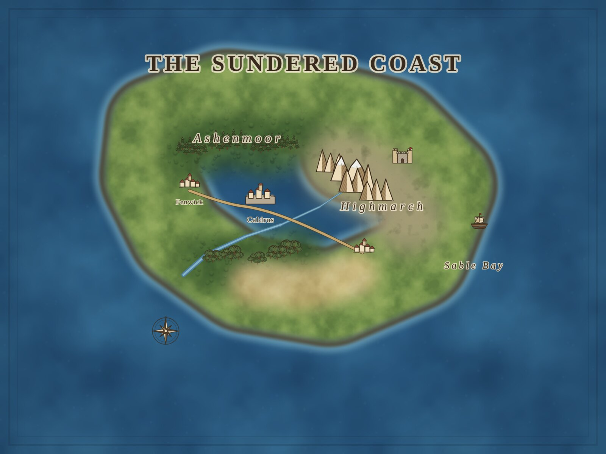
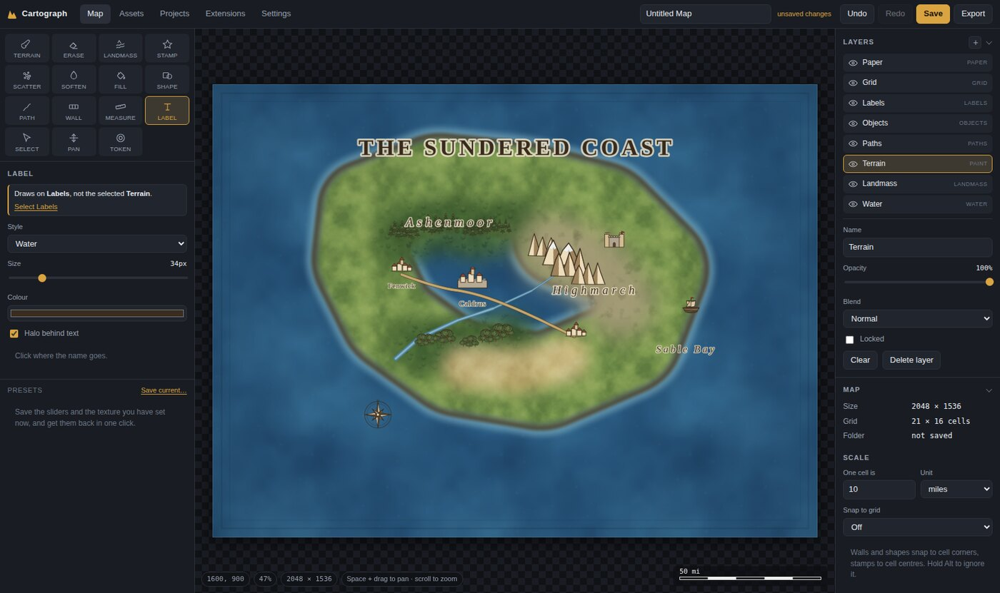

# Cartograph

A map maker for tabletop games that runs on your own machine. It opens in a
browser, but it is not a website: it is a program in a folder, with your maps,
your art and your exports sitting next to it as ordinary files you can open,
copy, back up and edit.

No account, no upload, no network. After the first launch it works with the
network cable out.





## Running it

**Windows** — double-click `run.bat`.
**macOS / Linux** — `./run.sh`.

Either way it starts a small local server, opens your browser at it, and prints
what it is doing in the console window. Close the window to stop it.

It needs **Python 3.8 or newer** and nothing else. No `pip install`, no virtual
environment, no download step — the whole program is the standard library plus
the browser you already have. If Windows says Python is not installed, get it
from [python.org](https://www.python.org/downloads/) and tick *Add Python to
PATH* during setup.

The first launch spends about ten seconds generating the starter art pack. It
does it once more whenever an update adds art to the generators, from the same
seed, so the new textures and symbols appear and everything already on your
maps comes back exactly as it was.

```
python app.py                    start it
python app.py --port 7860        pin the port
python app.py --no-browser       do not open a browser
python app.py --regen-pack --seed harbour    re-roll the generated art
```

`--port` and `--verbose` apply to that run only; they are not written back into
`config.json`. Neither is the free port picked when the one you pinned is busy.
To change the port for good, edit `config.json`.

## What is in the folder

```
run.bat / run.sh      launchers
app.py                entry point — first-run setup, then serve
config.json           written on first launch: port, whether to open a browser
server/               the local HTTP server and file API (standard library only)
  http.py               transport, static files, the security guards
  api.py                the JSON endpoints
  projects.py           reading and writing maps
  prefabs.py            reading and writing prefabs
  packs.py              indexing asset folders
  png.py                a PNG writer in eighty lines of zlib
  safe.py               every client-supplied path goes through here
tools/                the art generators
  terrain.py            seamless terrain tiles
  stamps.py             map symbols, as SVG
  noise.py              seamless value noise
  genpack.py            bakes the starter pack
web/                  the editor itself — plain ES modules, no build step
  js/hex.js             hex geometry: the one definition of where hexes are
  js/light.js           shadow casting for the lighting layer
  js/generate.js        seeded land: noise, marching squares, the dialog
  js/dungeon.js         seeded dungeons: rooms, corridors, walls, doors, the key
  js/clipboard.js       copy, cut, paste and duplicate
  js/prefabs.js         sets saved to put down on any map
  js/transform.js       turning and mirroring what Select holds
assets/packs/         asset packs; drop folders in here
  starter/              generated on first launch
  user/                 anything you import
projects/             your maps, one folder each
exports/              PNGs you export
prefabs/              sets of things you saved to reuse, one JSON file each
extensions/           extensions; one folder each, loaded at startup
  battle-tokens/        worked example: a tool and a layer kind
  hex-coordinates/      worked example: a generated layer and a side panel
  map-aging/            worked example: commands that draw on an existing layer
test/verify.mjs       82 end-to-end checks against the running program
test/lighting.mjs     29 more, for darkness, shadows and the VTT lights
test/hex.mjs          27 more, for hex snapping and hex-native measurement
test/guards.mjs       63 more, for the server's guards, over raw sockets
test/regress.mjs      107 more, for bugs that have been in here once already
test/generate.mjs     27 more, for seeded land generation
test/dungeon.mjs      34 more, for seeded dungeons
test/clipboard.mjs    39 more, for copy, paste and duplicate
test/selection.mjs    43 more, for holding several things at once
test/prefabs.mjs      41 more, for saving a set and putting it down elsewhere
test/transform.mjs    52 more, for turning and mirroring a set
test/hatch.mjs        27 more, for hatching the rock around the walls
docs/DAILY-LOG.md     what changed, day by day
EXTENSIONS.md         how to write your own extension
ASSETS.md             how to add your own art
```

## How a map is stored

A project is a folder, not an opaque file:

```
projects/The Sundered Coast/
  project.json      the whole map as readable JSON
  thumb.png         the picture shown on the Projects tab
  layers/           PNGs, only for layers holding imported pixels
```

`project.json` holds every brush stroke, stamp, path and label as **data** —
positions, sizes, textures, colours. The map is re-rendered from that when you
open it, which is why a saved map is a few kilobytes rather than a few
megabytes, and why you can diff two versions of it in git and see what changed.
Copy the folder to back a map up. Delete it to remove it.

## Working in it

The Map tab is the editor. Tools down the left with their options underneath and
the relevant art below that; the map in the middle; layers and map properties on
the right.

**Landmass** is the tool to start with. Paint where the land is and the
coastline draws itself — an ink line round the edge and a banded shallow-water
shelf outside it, both derived from the shape you painted and both updating as
you paint. Turn on *Carve sea instead* to cut bays and inlets back out of it.

Or let it start you off: **Generate land…** at the top of the Landmass panel
(and in the command palette) grows a coastline from a seed. Pick a shape — one
continent, a single island, an archipelago, scattered lands, or a coast running
off one side of the map — how much of the map is land, how large the features
are and how ragged the coast, and watch the preview change as you do. *Land 40%*
means forty per cent, whatever the seed. The same seed and settings always give
the same land, so a seed is worth writing down. What it writes is ordinary
landmass: the brush adds to it, the eraser bites into it, undo takes it back,
and a terrain fill set to *Inside the landmass* follows the new coast. The map
file keeps the traced coastline itself, a few kilobytes, with the seed and
settings beside it — so a map reopens exactly as it was even if a later version
of the generator draws that seed differently.

**Terrain** paints textures onto a normal paint layer: forest, sand, highland,
marsh, whatever is in your packs. **Stamp** places symbols — click for one, drag
to scatter a row of them, with size, tilt and spacing variation so a forest does
not look stencilled. It mixes the three drawn variants of each symbol by
default.

**Path** draws rivers, roads, trails and borders. Click along the route, press
Enter to finish, Esc to cancel, Backspace to drop the last point. Rivers widen
as they run. Each kind remembers its own width and colour.

**Region** shades a territory. Click round its border, press Enter to close it,
and give it a name: you get a tinted area, an outline and the name set across
the middle of it. Kingdoms, duchies, the reach of a forest, whose land is whose.
The fill is deliberately a tint rather than paint, so the terrain underneath
goes on reading through it, and the border can be solid, dashed or dotted — or
turned off, for an area with no agreed edge. A region map does not start with a
regions layer; pick the tool and the panel offers to add one.

**Label** places text in four cartographic styles. **Select** picks up anything
you have placed — a stamp, a path, a region by any point on its border, a wall,
a light, a label or a note. Drag it to move it, Delete to remove it, and change what it
is in the **Selected** panel at the top of the right rail: a region's colour,
fill and border, a road's width, a label's wording and size, a door turned into
a window, a lamp's reach in feet. Nothing here has to be decided before it is
drawn any more, and every change is one step in the history like any other.

What Select is holding can be **copied, cut, pasted and duplicated** — Ctrl+C,
Ctrl+X, Ctrl+V and Ctrl+D, or the Duplicate and Copy buttons in the Selected
panel. A paste lands under the pointer, or a cell on from the original when the
pointer is off the map; a duplicate lands one cell on. Either way it moves by a
whole number of cells, so a door copied off a grid line lands on a grid line and
a lamp copied from the middle of a cell (or of a hex) lands in the middle of
another, and the copy is
picked up ready to drag. It goes back onto the layer it came from, or onto the
same kind of layer on another map — the clipboard outlives opening a different
map, so a room's worth of furniture carries from one battle map to the next. A
pasted wall casts shadows at once, a note copied out of a generated dungeon
becomes your own (regenerating will not sweep it away), and every paste is one
step in the history.

Select can hold **several things at once**. Shift-click adds one or puts it back
down; drag a box on empty map to pick up everything the box wholly encloses
(wholly, so a box round three doors does not pick up the kingdom they stand in),
and hold Shift while dragging to add to what is already held. Ctrl+A picks up
everything on the map and Escape puts it all down. Drag any one of them and the
rest come with it; Delete, cut, copy, paste and duplicate all act on the whole
set, as one step in the history however many layers it spans — a room's walls,
its doors, its lamps and its furniture copy and paste together, each part onto
a layer of its own kind. Something on a layer you then lock or hide drops out
of what is held.

The Selected panel says what is held, and when it is all **one kind of thing**
it offers the fields they share: six torches turned blue, a corridor of doors
made secret, every village label set in one size, as one step in the history.
A field the things disagree on is marked *(mixed)* and shows the value of the
one clicked first. What makes each thing itself is left out — a label's
wording, a territory's name, a note's title and text — and so is a stamp's
angle, which the Turn buttons handle for the set as a whole. A mixed set (walls
and lamps, say) offers no fields; to change one thing on its own, press Escape
and click it.

Whatever Select holds can be **saved as a prefab** — *Save as prefab…* in the
Selected panel, *Save selection…* in the Select tool's panel, or the palette —
and put down again on any map, next week or on a friend's copy of the program. A
prefab is one readable JSON file in `prefabs/` beside the program, so it can be
copied, backed up and handed over like a map. The Select tool's panel lists them
as chips: click one to put it down in the middle of the view, picked up and ready
to drag into place; the × deletes the file, after asking. Putting one down is a
paste in every way that matters — one step in the history, each part onto a
layer of its own kind, walls snapped to the grid and casting shadows at once, the
first lamp turning the night on — and every prefab is also in the command palette
as *Place …*. A part with no layer of its kind on the new map (a note on a map
with no notes layer, say) is left out with a message, as a paste leaves it out.
Things go down at the size they were drawn: a prefab saved on a 70-px grid and
put down on a 100-px one says so, because its walls will not sit on the new
grid's lines.

Whatever Select holds can be **turned and mirrored**: R turns it clockwise and
Shift+R anticlockwise, and *Turn left*, *Turn right*, *Mirror* (left to right)
and *Flip* (top to bottom) are in the Selected panel and the palette. The set
turns as one rigid thing, so a stamp's own angle and a cone light's facing go
round with it and a chair still faces its table; text keeps reading left to
right. On a square grid a turn is a quarter, about a grid corner or a cell
centre; on a hex map it is a sixth, about a hex centre — the only turns that put
walls drawn on the lines back on the lines. A prefab comes down picked up, so it
can be turned into place straight away. Each turn is one step in the history,
four quarter turns land exactly where they started, and a turned wall casts its
shadow at once. With nothing held, R is still the Shape tool.

**Scatter** throws a handful of stamps down at once, thinning towards the edge
of the brush. **Fill** floods a whole region — the sea, the land, everything —
with one texture. **Shape** draws rectangles and ellipses, snapped to the grid
if you want them to be. **Soften** blurs whatever is under it, for taking the
hard edge off a coastline or a texture join. **Measure** reads out a distance in
the map's own units and stays on screen until you press Esc.

Whichever tool is selected, the panel says in words which layer it is about to
draw on — and offers to select that layer, or to make one, if the tool cannot
draw on what you have selected. That is the one thing about a layered editor
that is worth spelling out rather than leaving to be discovered.

### Battle maps

*New map* offers a battle map as well as a region map: feet instead of miles,
five-foot squares, snapping on by default, and a walls layer.

**Wall** draws walls, doors, secret doors and windows along the grid. They are
drawn on the map *and* written into the export as data: tick *Also write a
Universal VTT file* and you get a `.dd2vtt` next to the PNG, which Foundry,
Roll20 and the rest import with line of sight and door positions already built.

Or let it start you off: **Generate dungeon…** at the top of the Wall panel
(and in the command palette) lays out rooms and corridors from a seed on the
map's own grid, with a plan of it in the dialog as you change the settings —
how many rooms and how big, straight or winding corridors, how many loops, how
many doorways get doors, and whether a few of the doors on the loops are
secret. What it writes is ordinary map, not a picture:

- the walls, doors and secret doors go on the **Walls** layer as walls, so they
  cast shadows, go to a virtual tabletop as sight lines and doors, and can be
  selected and changed one at a time like any wall you drew;
- the floor goes on the **Terrain** paint layer in the texture you pick, so
  painting over it works as it always has, and the rock around it is shaded,
  hatched along the walls (see below) or left plain, as *Rock* says;
- and, if you like, every room gets a numbered **note** — *Entrance* first,
  then the rooms in the order a party would meet them, each with its size —
  which is the key the export can already set beside the map.

The same seed and settings always give the same dungeon on a map of that size.
Generating again replaces the dungeon — its floor, its walls and its numbered
notes, but not notes of your own — and one Ctrl+Z takes the whole thing away.
A secret door is only ever a second way into somewhere: a room whose only door
is hidden is a room nobody finds. Dungeons are laid out on square grids; a hex
map is told so.

**Hatching.** Select the Walls layer and tick *Hatch the rock around the walls*
for the look of an old hand-drawn plan: short bundles of pen strokes hugging the
rock side of every wall, the rock beyond left bare. *Width* is how far the band
reaches from the wall, *Stroke length* the size of the bundles, and *Ink* their
colour; each change is one undo step. Nobody has to say which side of a wall is
rock — it is worked out from the walls themselves, the way you would read the
plan: whatever touches the edge of the map is rock, a room closed off by walls
is floor, a corridor through its door is floor too, and a pocket of rock that a
ring of corridor closes off is rock again. So it works for walls you draw by
hand as much as for a generated dungeon, and it follows every wall you add,
move or delete. A room left open to the edge of the map counts as rock and is
hatched inside; close it with a wall or a door. The strokes are placed from
their position on the map, not drawn at random each time, so a wall added in
one corner leaves the hatching everywhere else exactly as it was, and the map
reloads exactly as it was saved. Generating a dungeon with *Rock: Hatched along
the walls* turns it on as part of the same step.

### Lighting for battle maps

A battle map comes with a **Lighting** layer. It is darkness with a hole cut in
it for every light, and it starts switched off — the first light you drop turns
the night on, and undo turns it back off.

- **The Light tool** drops a source where you click, and dragging aims a
  shuttered one. Sources are set in the map's own units, so a torch really is
  20 feet bright and 40 dim, and the presets are the ones from the rulebook:
  candle, torch, hooded lantern, light spell, campfire, daylight.
- **Walls cast the shadows.** A window is a wall you can see through, so it
  lights the room behind it; a closed door does not. Moving a wall moves its
  shadow with it.
- **The Lighting layer's panel** sets how dark the unlit map goes, the colour
  of the night, how much colour the lights wash over what they light, and
  whether walls cast shadows at all.
- **The tabletop export carries the lights as data**, and writes the image
  *without* the darkness. A virtual tabletop does its own lighting, and giving
  it a map that is already lit washes the whole thing out.

### Hex crawls

*New map* also offers a hex crawl, sized in hexes rather than pixels, and hexes
are first-class rather than merely drawable:

- **Stamps land in the middle of a hex** and walls, paths and shapes land on the
  corners, the same corner-or-centre distinction squares get. *Snap to half
  cells* adds the edge midpoints. Alt still ignores the grid entirely.
- **The measure tool counts hexes**, because a hex crawl counts in hexes and
  three hexes north-east is three hexes however long the pixel line is. It
  highlights the hexes it counted, so you can see the path it charged you for.
  With a real-world unit set it reads both: *24 mi · 4 hexes*.
- **Flat-top or pointy-top**, switchable in the Grid layer's panel. Everything
  that touches the grid follows, including the coordinates extension.

The hex layer's *Hex width* is measured corner to corner. The distance the scale
counts is across the flats, which is shorter — the panel tells you both, because
a map that quietly measures 15% long is worse than one with no scale at all.

### Notes and the key

**Note** (N) pins a numbered note to the map: a title and as much text as it
needs under it. The room key of a dungeon, the points of interest on a hex
crawl, the rumour attached to a village. Pick the tool and its panel offers to
add a notes layer, which sits on top of everything else so a pin is never under
the grid or the paper.

- **The number is its place in the list.** Delete note 2 and the old 3 becomes
  2 — on the pin, in the list and in the key at once, because none of them keeps
  a number of its own that could disagree. The Notes layer's panel lists them in
  order, and clicking one selects it.
- **Select edits them**: title, note and pin colour in the Selected panel, drag
  to move, Delete to remove, each one a step in the history.
- **The export sets the key beside the image** — the same pins, numbered the
  same, on a strip of parchment down the right-hand side — and can also write
  it as a Markdown file named after the image, `Harbour-key.md` beside
  `Harbour.png`. A key longer than the map runs on below it rather than being
  cut off.
- **The players' copy leaves the pins off** (see below), and a hidden notes
  layer's pins are neither drawn nor keyed. Two notes layers — yours and
  theirs, say — each count from 1 and get their own heading in the key.

### Printing at scale

A battle map is still most often used on a table, under miniatures, and a
miniature wants a one-inch square. **Print** in the top bar (Ctrl+P, or *Print
at scale…* in the palette) writes a PDF that puts the map on paper at that
size, across as many sheets as it takes:

- **One square prints the size you choose** — an inch, 25 mm, 30 mm, 20 mm or
  half an inch. On a hex map it is one hex measured across the flats, the way
  hex mats are sold. A region map prints its grid cell at that size.
- **A4, US Letter, A3 or Tabloid**, portrait or landscape, or whichever of the
  two takes fewer sheets. The dialog shows the sheets over a picture of the map
  and says how many there are and how big the whole thing comes out.
- **Each sheet carries a strip of overlap** (none, 5, 10 or 15 mm) printed on
  both neighbours. Trim a sheet at the edge of its picture on the left and at
  the top, where the corner marks are, and lay it over its neighbours with
  that edge on their dashed line; the strip underneath takes the glue.
- **Every sheet is labelled** like a spreadsheet — A1, B1, A2 — with the sheets
  it goes beside, and has a **scale bar** at its foot to check with a ruler
  before cutting. Print at 100% (*Actual size*); a printer set to *Fit to page*
  shrinks everything, and the bar is how you find out.
- **An optional first page** shows the whole map with the sheets drawn over it.

The PDF goes into `exports/` beside the PNGs, and a copy downloads. Quality
runs from 100 to 300 dpi; 150 is plenty for a battle map. The grid, the
lighting and the note pins can each be left off, as on export. A print of more
than 200 sheets is refused — that is a poster, and wants a print shop and a
PNG. Printing does not touch the map and is not a step in the history.

### The players' copy

The map the GM keeps and the map the players are shown are not the same
picture. Tick **Also write a players' copy** in the Export dialog, or pick
*Copy: The players'* in the Print dialog, and Cartograph makes the second one
from the same layers:

- **Secret doors are drawn as plain wall**, the way the players believe them
  to be. The GM's copy keeps the dashed door.
- **Note pins are left off.** The numbers are the GM's key, and a numbered
  room is a spoiler.
- **Any layer marked GM only is left out.** The switch is in every layer's
  properties, under *Locked*; a group marked GM only takes every layer in it
  out too, and the layer row says **GM**. Traps, a hidden treasure stamp, the
  GM's own labels — put them on a layer of their own and mark it.

The dialog says what the players' copy will change before you make it. Export
writes `Harbour-players.png` beside `Harbour.png`, and with the Universal VTT
box ticked a `Harbour-players.dd2vtt` too, in which a secret door goes across
as a wall rather than a door, so the tabletop does not give it away with a door
icon; turn it into a door there when it is found. Printing writes
`Harbour - players - print.pdf`, and says *(players' copy)* on every sheet.

Nothing about the players' copy is stored except the GM-only mark: it is the
same map looked at another way, so the two copies cannot drift apart. Marking a
layer changes nothing on screen or in the GM's copy, and is a step in the
history like anything else.

### Working at scale

**Layer groups** are folders. Add one from the **+** in the Layers panel and
drag layers onto it; its visibility and opacity apply to everything inside, and
folding it away gets a long stack back under control. Deleting a group frees
its members rather than deleting them — it is a folder, not a container.

**Brush dynamics** let a pen's pressure, or the speed of the stroke, drive the
brush width. Width only, never opacity: painting here is mask-then-texture
precisely so that overlapping parts of one stroke do not darken each other, and
varying the opacity along a stroke would put that back. A mouse has no pressure
to report, so on a mouse the pressure setting changes nothing.

**Stamp shadow and tint** are set once on the Objects layer rather than on each
symbol, because a map wants every tree lit from the same direction.

### Presets, history and the palette

Any tool's settings — every slider plus the texture or stamp it is pointing at —
can be saved as a named preset from the bottom of the tool panel, and come back
in one click. Presets are searchable in the command palette too.

The **History** panel on the right lists every step of the session. Click any
one of them to wind the map to that point, and click a later one to replay
forwards. Panels in that rail fold away by their headings, and stay folded.

**Ctrl+K** opens the command palette: every tool, command, layer, preset and tab
in one list you can type at. It matches subsequences, so `ftm` finds *Fit the
map in the window*.

### Making it yours

Settings → Interface has five themes, six accents plus a colour picker,
interface scale, which side the tools live on, panel widths, corner rounding,
canvas backdrop, a compact icon-only tool rail, and switches for the status bar
and the scale bar. It is all CSS custom properties underneath, so a theme is a
table of colours and adding one is a few lines.

| | |
|---|---|
| `B` `E` `L` | Terrain brush · Eraser · Landmass |
| `G` `F` `R` | Scatter · Fill · Shape |
| `S` `P` `T` | Stamp · Path · Label |
| `W` `M` | Wall · Measure |
| `V` `H` | Select · Pan |
| `[` `]` | Smaller and larger brush |
| Space + drag | Pan from any tool |
| Scroll | Zoom about the pointer |
| `0` | Fit the map in the window |
| `Ctrl+K` | Command palette |
| `Ctrl+S` `Ctrl+E` `Ctrl+N` | Save · Export · New map |
| `Ctrl+Z` `Ctrl+Shift+Z` | Undo · Redo |
| `Ctrl+C` `Ctrl+X` `Ctrl+V` `Ctrl+D` | Copy · Cut · Paste · Duplicate |
| `R` `Shift+R` (holding something) | Turn what Select holds clockwise · anticlockwise |
| Shift+click, drag on empty map | Add to what Select holds · pick up what a box encloses |
| `Ctrl+A` `Esc` | Pick up everything · put it all down |
| Alt (held) | Ignore grid snapping |

## Extensions

Everything the editor can do, an extension can add to: tools, layer types,
panels, commands, export formats. An extension is a folder under `extensions/`
with a manifest and an ES module — no build step, no bundler, no package
manager. Three worked examples ship with the program and
[EXTENSIONS.md](EXTENSIONS.md) documents the API.

They are not sandboxed. An extension runs with the same reach the editor has, so
read one before you put it in the folder. The Extensions tab lists what loaded,
what failed and why, and lets you turn any of them off.

### Furnishing a battle map

The starter pack has floors as well as ground: **flagstones**, **wooden
floorboards** and **cobblestones**, under *floor* in the texture picker. Pick
one for the Floor layer in the Layers panel, paint it with **Terrain**, or give
it to **Generate dungeon…** as its floor. They tile at five feet to the
seventy-pixel square, the scale of a new battle map.

And furnishings to stand on them, drawn from above rather than side-on, under
*furnishing* in the stamp picker: a barrel, a crate, a table, a bed, a chest, a
bookshelf, a rug and a well, three variants of each. At a size of 1 they are
drawn to the grid -- a table is two squares long, a bed one by two -- and the
Stamp tool mixes the variants as it does for trees.

## Adding your own art

See [ASSETS.md](ASSETS.md). Short version: drop a folder of PNGs into
`assets/packs` and press *Rescan folder*, or use *Import files…* on the Assets
tab. Anything in a `terrain` sub-folder becomes a brush texture; everything else
becomes a stamp.

## Notes on how it is built

**It only listens to itself.** The server binds to `127.0.0.1`, never to the
network. Any request carrying an `Origin` that is not this server is refused, so
a page open in another tab cannot drive the file API. A refused request also
closes the connection rather than answering and reading on: this is a keep-alive
server, and a body left unread on the socket is parsed as the next request —
one that carries no `Origin` and so passes the check the first one just failed.
That is true of **every** request, not only the ones addressed to the file API:
a body is read or refused before the server decides what the request was for,
because the socket does not care which handler was going to answer. Every path a
request names — project, pack, asset — is resolved and then checked to be inside
the folder it belongs to before anything is opened.

**Other people's files run nothing.** Art packs and map folders are served with
a sandboxing header, so an SVG or an HTML file in a pack you downloaded cannot
run a script as the editor if it is opened as a page. Numbers JSON cannot
carry — `NaN`, `Infinity` — are refused on the way in, from a request or from a
file on disk, rather than written back out in a form the browser cannot read.

**The art is generated, not downloaded.** `tools/terrain.py` and
`tools/stamps.py` write the whole starter pack from a seed, so there is nothing
shipped whose licence you have to take on trust, and the pack can be re-rolled.
Terrain tiles are raster and wrap seamlessly; symbols are SVG so they stay sharp
when you export at print size. The pack records the version of the generators
that baked it (`ART_VERSION` in `tools/genpack.py`), and an older pack is
rebaked on launch from its own seed and tile size. That only works because art
is only ever added: a recipe already in the pack is never changed, since every
map on disk is drawn from it, and `test/art.mjs` checks that a bake is
byte-for-byte repeatable.

**Painting is a mask, then a texture poured into it.** A stroke is drawn as a
shape first and the texture is filled into that shape, rather than the texture
being smeared along the path. That is what stops the overlapping parts of a
single stroke darkening each other at anything below full opacity.

**Only what changed is redrawn.** Each layer owns an offscreen canvas; those are
composited into one flat image, and the flat image is what the screen draws
under the pan-and-zoom transform. Panning and zooming re-run no painting at all,
and a brush stroke re-composites only the rectangle it just touched — so a long
drag costs the same per frame as a short one.

**The chrome is one table of custom properties.** Every colour, radius and rail
width in the interface is a CSS variable on `:root`; a theme sets a dozen of
them and the light-mode flag is derived from the background's luminance rather
than hard-coded, so a theme added by hand gets readable selection colours for
free.

**A reloaded map is pixel-identical to the one you saved.** The coastline is
derived work — a shelf grown from the land mask, an ink line traced round it —
and deriving it in pieces while you paint has to produce exactly what deriving
it in one go at load time produces. The repaint rectangles are snapped to a grid
and the shelf is grown on a whole-canvas copy of the mask for precisely that
reason. `test/verify.mjs` asserts it.

## Testing

Start the program, then:

```
node test/verify.mjs http://127.0.0.1:7870
```

82 checks driving the real program in a real browser: the server's two security
guards, every tool actually painting, undo and redo, the save/reload round trip
rendering identically, importing a file and finding it in the picker without a
restart, export writing a correctly sized PNG, layout at two window sizes, the
two painting costs that have to stay inside a frame, theming and interface
settings surviving a restart, presets round-tripping, the history panel winding
a map back and replaying it to exactly the same pixels, the scale bar, and the
extension host loading all three examples and rendering a custom layer kind.

There are narrower scripts beside it, 872 assertions in all: `art.mjs`
(the starter pack's art: an older pack rebaked on launch from its own seed and
size, a current one left alone, a bake repeatable byte for byte, the floor
textures in the library and meeting their own edges, the furnishings and their
variants, the floor laid from the layer panel and offered to the dungeon
generator, a stroke in floorboards and every furnishing placed with the real
tools, and the round trip), `setedit.mjs`
(editing a set: the fields one kind of thing shares offered and the ones that
make each thing itself left out, a disagreement marked, one change reaching
them all as one step and coming back exactly on undo and redo, a mixed set
offering nothing, walls made windows relighting the map, and the round trip),
`players.mjs`
(the players' copy: exactly the GM's picture with the pins off, the secret
doors drawn as walls and the GM-only layers out, the GM's copy and the screen
untouched by the mark, a group marking its members, the mark's undo step and
round trip, the tabletop file agreeing with the picture, and Export and Print
writing the copy), `print.mjs`
(printing at scale: the sheets covering the map with exactly the overlap
between them, a square printing exactly its size on A4, Letter and a hex map,
the PDF's cross-references, a piece of the map matching the whole, the map
and its history left alone, Ctrl+P and the file in `exports/`), `hatch.mjs`
(hatching: a closed room clean and the rock round it hatched, a door joining
floor to floor, a front door from the rock, a pocket of rock inside a ring of corridor, the panel's undo
steps, stability as walls are added, the dungeon's Rock setting and the round
trip), `transform.mjs`
(turning and mirroring a set: walls kept on the grid and the hex lattice, a
stamp's angle and a cone's facing turned with it, four turns home exactly, undo,
the shadow following a turned wall, and the round trip), `prefabs.mjs`
(saving a set, the file on disk, putting it down on another map as one step
with its shape kept and its walls on the grid, the round trip, names shown as
text, and the server refusing what could not be placed), `selection.mjs`
(holding several things: shift-click, the box, moving, deleting and pasting a
set across layers, a lock dropping one out, and the round trip), `clipboard.mjs`
(copy, cut, paste and duplicate: where a copy lands, which layer, undo, the
round trip, and between maps), `dungeon.mjs`
(seeded dungeons: the layout, the walls as walls, undo and the round trip), `notes.mjs`
(numbered notes, their renumbering, and the key beside the image and in
Markdown), `generate.mjs` (seeded land, its round trip, and a fill that follows it), `props.mjs`
(changing a thing after it has been drawn), `lighting.mjs`
(darkness, wall shadows, cone lights and the tabletop lights), `hex.mjs` (hex
snapping, measurement and both orientations), `labels.mjs` (text along a path),
`regions.mjs` (territories, their names and the round trip), `brushes.mjs` (the
newer brush types, brush dynamics, stamp shadow and tint), `ext.mjs` (the
extension host, including unload), `pro.mjs` (presets, history and layer
groups), `theme.mjs` (interface settings), `battle.mjs` (grid snapping and the
VTT export), `guards.mjs` and `regress.mjs`.

`guards.mjs` is the odd one out: it needs no browser, because what it checks is
what the server does with bytes a browser would never send in that order — a
body left on a keep-alive socket after a request is refused, two `Content-Length`
headers that disagree, a `Content-Length` that is not a number, a NUL byte in a
path, a `Host` header naming some other site, and a manifest that is valid JSON
of entirely the wrong shape. `regress.mjs` is a standing guard
against the bugs listed in `docs/DAILY-LOG.md` coming back.

Every suite makes its own map before it starts. The editor reopens the last map
on launch, which is right for a person and wrong for a test — without it, two
suites run back to back and the second inherits the first one's map, then fails
somewhere with nothing to do with the cause.

```
npm install playwright
npm run browser            # playwright install chromium
npm run verify -- http://127.0.0.1:7870
```

If Playwright cannot find a browser — a container that keeps them somewhere
unusual — point `CG_CHROME` at a Chrome or Chromium binary. `CG_BASE` sets the
server URL for every script, as does passing it as the first argument. Nothing
in the program itself needs Node.

## Licence

MIT — see [LICENSE](LICENSE). The generated art pack is CC0.
